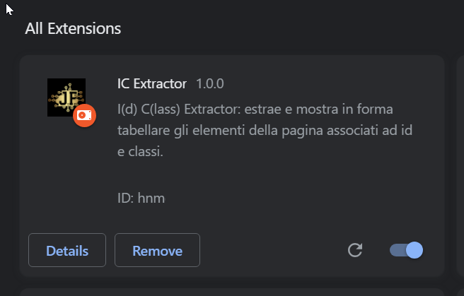
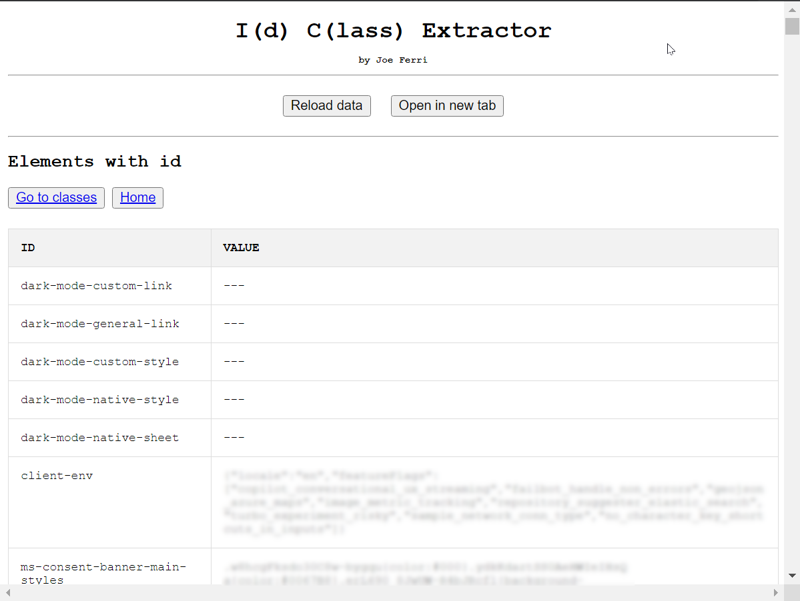

# I(d) C(lass) Extractor

**Extracts and displays the page elements associated with id and classes in tabular form.**

---

## Description

**IC Extractor** is a utility extension for web developers.

Do you want to analyze a web page by extracting all `id`/`class`, element binding?

Are you getting lost in the tangle of HTML?

**IC Extractor** allows you with a simple click to get a list of `(id,value)` and `(class,value)` pairs in a **popup** with two clear, no-frills tables.

Do you want the tables in a full-size tab? You can do it.

---

## Future Features

- export button in **JSON** format
- export button in **CVS** format
- export button in **EXCEL** format

---

## Installation

Download the **IC Extractor** folder to your PC.

Follow the instructions at [Mit Chrome Extension](https://github.com/JoeFerri/mit-chrome-extension)

---

## Usage

1. Open **Chrome**.
2. Go to the address of the page you want to analyze.
3. Click on the extension icon
4. Navigate the popup tables to analyze the `id` and `class` of the page elements
5. Click **Open in new Tab** to open the tables in a full-size tab
6. Click on **Refresh** to reload the table data

---

## LOGIC: frame.js <--> popup.js

Once the **popup** page loads, it sends an **analyzePage** message to the current tab via the Chrome API.

The message is received by all **frames** on the **main page**.

Each **frame**, either after its DOM is fully loaded, or after receiving the `analyzePage` message, sends its element data within a `frameReadyToAnalyze` message to the popup.

The diagram below shows the logic of a single **frame**.

[](https://mermaid.live/edit#pako:eNqNU8lu2zAQ_RViTjZACZJlLSFaA0XTQw9piySnQkAwESeOUG0lqbSK4Xx7qS21nTQoDwJFvjfvzcIdZLUkEKDpZ0tVRuc5bhWWacXsalCZPMsbrAy7s6d0_vXiHzcvj5u6aZuXx1RQSZW5xtuCPsu37z8WqPUIwWISYs8eZkeOs9kMe8EUoey0QUPZPVbbydWX2hCrH0g9UybkVY9k71lqq1A2BRlKYaRQoekog37rOMtJByssukf6hrMEVfLAlAUOBDH-XvZa1_WHkTTlk5n8oVc_EDnxKeZaaGvxQHGxfBXO2aSp-lZqY0kzf8QrygxT21tceJytvP4Thpy5XrA8THKzOW6RYDLXTYHdpynaYhJw5_Bv0IcO_neEvxkdW-DslZglaW2rcYm_2LsntrvJpeY32XC3P2mKpNNyA4eSVIm5tLO_61EpmHurkYKwW4nqRz8Ke4vD1tRXXZWBMKolDm0jbaDpnYC4QzsqHOzsgtjBbxB-7LmJ50Xrs9hPvNBfcehAOH7orqLEj5JgHcVRHCfxnsNjXdsQvut7_VqFXhCchUGw5kAyN7W6GB_n8EYHje8DYdDc_wH2dT85)
