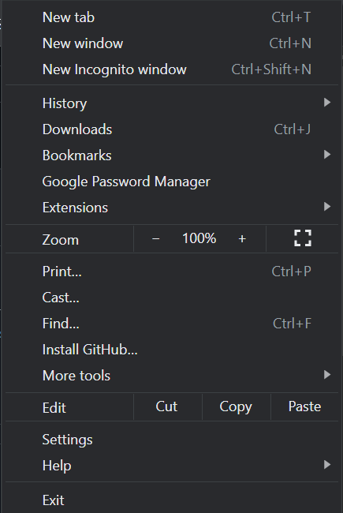
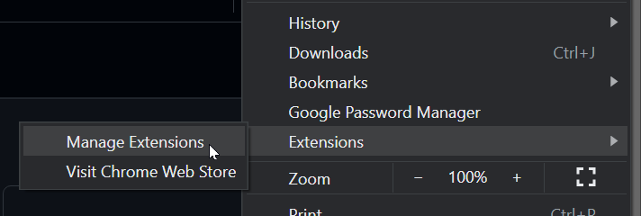
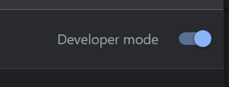
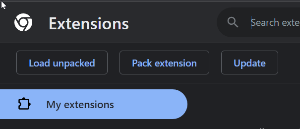
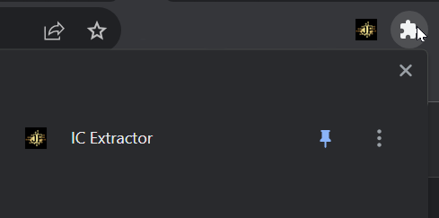

# mit-chrome-extension
Extensions for Chrome. #extension #chrome

## Installation

Download the **extension folder** to your PC.

1. Click on the menu at the top right (the three vertical dots).

2. Move the cursor to **Extensions**, then click on **Manage Extensions**.

3. Click **Developer Mode** if it is not enabled.

4. Click **Load Unpackaged Extension** and select the **IC Extractor** folder you downloaded.

5. Now the extension is active on your Chrome browser, you can pin it in the top bar by clicking on the puzzle icon.

For more information on how to create a Chrome extension follow the instructions at these links:

[support.google.com - English](https://support.google.com/chrome/a/answer/2714278?hl=en)

[support.google.com - Italian](https://support.google.com/chrome/a/answer/2714278?hl=it)

[freecodecamp.org - English](https://www.freecodecamp.org/news/building-chrome-extension/)

[freecodecamp.org - Italian](https://www.freecodecamp.org/italian/news/come-creare-la-tua-estensione-di-google-chrome/)

## Documentation
For the documentation see the notes inside the source code or [wiki page](https://github.com/JoeFerri/mit-chrome-extension/wiki)

### Code of conduct
[ENG](code_of_conduct-eng.md)

[ITA](code_of_conduct-ita.md)

# License 

## MIT license 

Copyright (c) 2023 Giuseppe Ferri

Permission is hereby granted, free of charge, to any person obtaining a copy of this software and associated documentation files (the “Software”), to deal in the Software without restriction, including without limitation the rights to use, copy, modify, merge, publish, distribute, sublicense, and/or sell copies of the Software, and to permit persons to whom the Software is furnished to do so, subject to the following conditions:

The above copyright notice and this permission notice shall be included in all copies or substantial portions of the Software.

THE SOFTWARE IS PROVIDED “AS IS”, WITHOUT WARRANTY OF ANY KIND, EXPRESS OR IMPLIED, INCLUDING BUT NOT LIMITED TO THE WARRANTIES OF MERCHANTABILITY, FITNESS FOR A PARTICULAR PURPOSE AND NONINFRINGEMENT. IN NO EVENT SHALL THE AUTHORS OR COPYRIGHT HOLDERS BE LIABLE FOR ANY CLAIM, DAMAGES OR OTHER LIABILITY, WHETHER IN AN ACTION OF CONTRACT, TORT OR OTHERWISE, ARISING FROM, OUT OF OR IN CONNECTION WITH THE SOFTWARE OR THE USE OR OTHER DEALINGS IN THE SOFTWARE.
